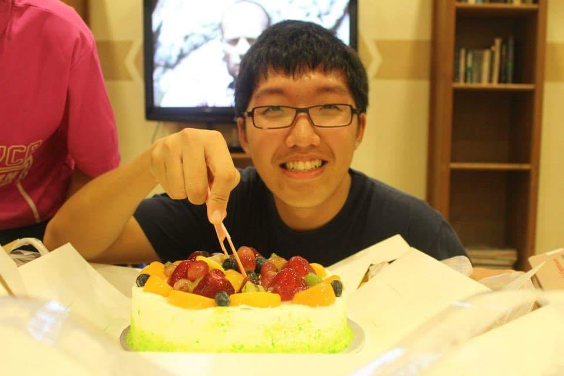
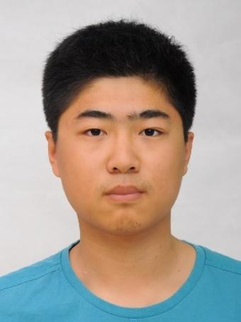
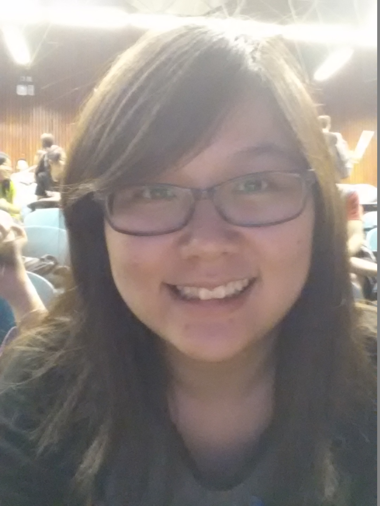

# About Us

We are a team based in the [School of Computing, National University of Singapore](http://www.comp.nus.edu.sg).

## Project Team

#### [Chen PengHao](https://github.com/chenpenghao)  
 
Role: Developer

* In Charge of: Model  
* Responsibilities: Scheduling  
* Features implemented:
	* Implement new feature to a task: Urgency level
	* Enable task parameters to be optional
	* Complete Command
	* Enable auto-sorting of task list
* Code written:
	* [Functional Codes]
	* [Test Codes]
* Major Contributions:
	* Updated User stories and Use Cases in DeveloperGuide.md
	* Refactoring of codes from address book to to-do list
	* Integrated PrettyTime package
	* Cleared model and logic tests

-----

#### [Jia YiLin](https://github.com/emiyak)
 
Role: Developer  

* In Charge of: Commons  
* Responsibilities: Integration  
* Features implemented:
	* Add new feature to a task: Description
	* Undo command
	* Save command
	* Parse multiple indexes
	* Selection of tasks (multiple selection & auto selection)
	* Omit input indexes
	* Search for keywords
* Code written:
	* [Functional Codes]
	* [Test Codes]
* Major Contributions:
	* Refactor tasks from one list to three lists
	* Help in debugging tests
	* Contribute to User stories and Use cases

-----

#### [WANG CHI](https://github.com/wangchi92)
 
Role: Developer  

* In Charge of: Storage & Logic  
* Responsibilities: Testing  
* Features implemented
	* Autocomplete feature for command prefixes.
	* Command history popup.
	* Command - Change data file save path command.
	* Command - Import data from a file.
	* Hotkey launch with Ctrl+T
* Code written:
	* [Functional Codes]
	* [Test Codes]
* Major Contributions:
	* Debugging tests especially GUItests.
	* Managed and enforced branching and merging.
	* Imported JNativeHook library.
	

-----

#### [Yina Toh](https://github.com/yinatoh)
 
Role: Developer  

* In Charge of: UI  
* Responsibilities: Documentation  
* Features implemented
	* Help command
	* Scrolling using keyboard
	* Change Ui to 4 lists
* Code written:
	* [Functional Codes]
	* [Test Codes]
* Major Contributions:
	* Contribute to User stories and Use cases

-----
