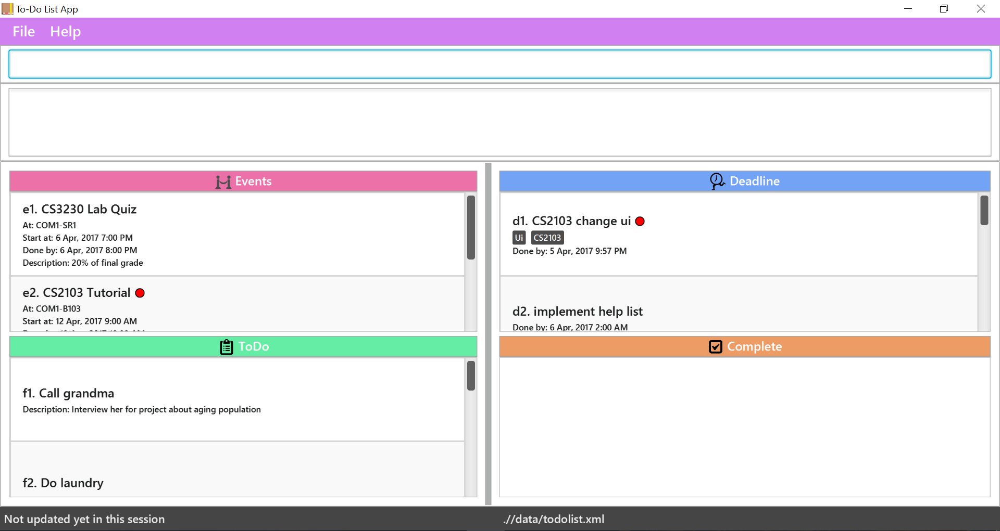

# To-do List - User Guide

By : `Team SE-EDU`  &nbsp;&nbsp;&nbsp;&nbsp; Since: `Jun 2016`  &nbsp;&nbsp;&nbsp;&nbsp; Licence: `MIT`

---

1. [Quick Start](#1-quick-start)
2. [Features](#2-features)
3. [FAQ](#3-faq)
4. [Command Summary](#4-command-summary)

## 1. Quick Start

0. Ensure you have Java version `1.8.0_60` or later installed in your Computer. 

   > Having any Java 8 version is not enough.  
   > This app will not work with earlier versions of Java 8.

1. Download the latest `todolist.jar` from the [releases](../../../releases) tab.
2. Copy the file to the folder you want to use as the home folder for your ToDoList.
3. Double-click the file to start the app. The GUI should appear in a few seconds.
   > 

4. Type the command in the command box and press <kbd>Enter</kbd> to execute it.  
   e.g. typing **`help`** and pressing <kbd>Enter</kbd> will open the help window.
5. Some example commands you can try:
   * **`list`** : lists all tasks
   * **`add`**`Do tutorial /by 14.02.17` :
     adds a deadline task describing `Do tutorial` to the todolist.
   * **`delete`**` f3` : deletes the 3rd task shown in the float list
   * **`exit`** : exits the app
6. Refer to the [Features](#features) section below for details of each command. 

## 2. Features

> **Command Format**
>
> * Words in `UPPER_CASE` are the parameters.
> * Items in `SQUARE_BRACKETS` are optional.
> * Items with `...` after them can have multiple instances.
> * Parameters can be in any order.

### 2.1. Viewing help : `help`

Format: `help [COMMAND]`

> * A list of all available commands will be shown in the display area if command parameter is absent.
> * The usage of the specified command will be shown in the display area if command parameter is present.

Examples:

* `help add` 
  Add command usage would be shown in the display area.

### 2.2. Adding a task: `add`

Adds a task to the todolist
Format: `add TITLE /venue [VENUE] /on [DATE] /from [DATE_TIME] /to [DATE_TIME] /by [DATE_TIME] /level [DATE_TIME] /description [DESCRIPTION] #[TAG]...`

> * TITLE represent the task (complusory)  
> * /venue represents the location for the task  
> * /on represents the date of the event task  
> * /from represents the starting time of the event task  
> Note: If /to parameter is not given as well, the task would be changed to a Todo task instead
> * /to represents the ending time of the event task  
> Note: If /from parameter is not given as well, the task would be changed to a deadline task instead
> * /by represents the deadline of the deadline task  
> Note: /to parameter and /by parameter are mutually exclusive
> * /level represents the urgency level of the task  
> Note: Tasks can have 4 level of priority (0 - 3) with 3 being the highest
> * /description represents the description of the task  
> * #[TAG...] represents the tag  
> Note: Tasks can have any number of tags (including 0)

### 2.3. Listing all tasks : `list`

Shows a list of tasks in the todolist 
Format: `list /on [DATE_TIME] /from [DATE_TIME] /to [DATE_TIME] /by [DATE_TIME]`

> * list without any input following the command word will by default list out all tasks in the list.
> * list /from will produce a list of all tasks whose deadlines or whole duration falls after the boundary time.
> * list /to will produce a list of all tasks whose deadlines or whole duration falls before the boundary time.
> * list /on, different from its usage in add and edit, will list only those tasks involving a start or end time **on the respective day**

Examples:

* `list` 
All tasks will be shown
* `list /from 7 April` 
Tasks with start time or deadline of 7 April will be shown

### 2.4. Editing a task : `edit`

Edits an existing task in the todolist. 

Format: `edit INDEX /title [TITLE] /venue [VENUE] /on [DATE] /from [DATE_TIME] /to [DATE_TIME] /by [DATE_TIME] /level [LEVEL] /description [DESCRIPTION] #[TAG]...`

> * Edits the task at the specified `INDEX`.
   * The index refers to the index number shown in the last task listing.  
   * Index **must include the type of task**, e.g. f1 for 1st float task and **must be followed by a positive integer** 1, 2, 3, ...  
> * At least one of the optional fields must be provided.
> * Existing values will be updated to the input values.
> * When editing tags, the existing tags of the task will be removed i.e adding of tags is not cumulative.

Examples:

* `edit d1 /title Do tutorial /to 17.09.19` 
  Edits the title and deadline of the 1st float task to be `Do tutorial` and `17.09.19` respectively.

### 2.5. Finding all tasks containing any keyword: `find`

Finds tasks that contain any of the given keywords. 
Format: `find KEYWORD...`

> * The search is not case sensitive. e.g `lunch` will match `Lunch`  
> * The order of the keywords does not matter. e.g. `Lunch Plan` will match `Plan Lunch`  
> * Tasks matching at least one keyword in either their titles, venues, descriptions, tags, or string representation of time, will be returned (i.e. `OR` search).  
    e.g. `Lunch` will match `Lunch Plan`

Examples:

* `find Lunch` 
  Returns `Lunch Plan` and `lunch`
* `find Breakfast Lunch Dinner` 
  Returns any task having names `Breakfast`, `Lunch`, or `Dinner`

### 2.6.1 Deleting a task : `delete`

Deletes the specified task from the todolist.  
Format: `delete INDEX [PARAMETER]...`

> * Deletes the task at the specified `INDEX`.  
 * The index refers to the index number shown in the last task listing.  
 * Index **should include the type of task**, e.g. f1 for 1st float task and **must be followed by a positive integer** 1, 2, 3, ...  
 * Notice that input only a positive integer without the type of task will by default be taken as a deadline task index.

Example:

* `list` 
  `delete f2` 
  Deletes the 2nd float task in the todolist.

### 2.6.2 Deleting a parameter of a task : `delete`

Deletes the specified parameter of a task in the todo list
Format: `delete INDEX /venue VENUE, /from or /on STARTTIME, /to or /by ENDTIME, /level URGENCY /description #[TAG]`

> * Deletes the parameter at the of the task at the specified `INDEX`.  
    * The index refers to the index number shown in the last task listing.  
    * Index **should include the type of task**, e.g. f1 for 1st float task and **must be followed by a positive integer** 1, 2, 3, ...  
    * The parameter indicated by the prefix will be deleted for the declared tasks, if they have one.  
    * Notice that title can never be deleted. If a task has its start time or end time deleted, its task category will be changed accordingly.

Examples:

* `list` 
  `delete f2` 
  Deletes the 2nd float task in the todolist.
* `list` 
  `delete e4 /from /description`
  Deletes the end time and description of the 4th event task in the todolist.

**Note: If select was the previous command, index is not needed.**

###2.7. Complete a task: `done`

Marks the task as complete and put in under the completed list.  
Format: `done INDEX`

> * Mark the task at the specified `INDEX` as complete. 
> * The index refers to the index number shown in the most recent listing. 
    * The index refers to the index number shown in the last task listing.  
    * Index **should include the type of task**, e.g. f1 for 1st float task and **must be followed by a positive integer** 1, 2, 3, ...  
    * Notice that input only a positive integer without the type of task will by default be taken as a deadline task index.

Examples:

* `list` 
  `done d2` 
  Marks the 2nd deadline task in the todolist as complete.  

### 2.8. Select a tasks: `select`

Selects the tasks identified by the index number used in the last task listing. 
Format: `select INDEX...` or `INDEX` or `RANGE OF INDEX`

> * Selects the task at the specified `INDEX`. 
> * The index refers to the index number shown in the most recent listing. 
    * The index refers to the index number shown in the last task listing.  
    * Index **should include the type of task**, e.g. f1 for 1st float task and **must be followed by a positive integer** 1, 2, 3, ...  
    * Notice that input only a positive integer without the type of task will by default be taken as a deadline task index  
    * You can select tasks without typing out "select". Just the indexes would be fine.  
    * You can select tasks in a range, with the indexes connected by a dash without space.  
    * For the case of multiple indexes, the sequence of the number does not matter. You can do either e2-4 or e4-2.  
    * After selection of tasks, you can carry out further actions. Available actions are: edit, delete and complete.

Examples:

* `list` 
  `select e2` 
  Selects the 2nd event task in the todolist.
* `list` 
  `select f1-f5` or `select f1-5` or `select f5-1` 
  Selects the 1st to 5th todo task in the todolist.
* `list` 
  `select e2, d4` 
  Selects the 2nd event task and 4th deadline task in the todolist.

Note: It is not necessary to type in the select command **if the index of the task is given**

### 2.9. Undoing previous command : `undo`

Undo previous command
Format: `undo`

> * Undo the most recent three operations that are undo-able.  
> * The undo-able commands are: add, delete, complete, clear.

### 2.10. Clear ToDoList: `clear`

Clear all the tasks in the ToDoList  
Format: `clear`

### 2.11. Exiting the program : `exit`

Exits the program. 
Format: `exit`

###2.12. Saving the data: `save`

Save a copied data file in another location.
Format: `save FILE_PATH`

Examples:

* `save C:/Users/Computing/Desktop/CS2103` 
  A new copied data file will be created in C:/Users/Computing/Desktop/CS2103.

**Note: **
ToDoList data are saved in the hard disk automatically after any command that changes the data. 
There is no need to save manually.

###2.13. Changing the data file location: `changedir`

Loads the data and set data storage location to filePath.
Format: `changedir FILE_PATH`

Examples:

* `changedir C:/Users/Computing/Desktop/CS2103` 
  Loads the data and set data storage location to C:/Users/Computing/Desktop/CS2103.

###2.14. Changing the data file location: `import`

Imports tasks from the data file specified.
Format: `import FILE_PATH`

> * The file in the specified file path should be an xml file
> * The path can be relative or absolute addressing

Examples:

* `import C:/Users/Computing/Desktop/CS2103` 
  Import the tasks from the data file in C:/Users/Computing/Desktop/CS2103.

### 2.15. Tell me a joke : `joke`

A joke would be shown to humour you. 
Format: `joke`

## 3. FAQ

**Q**: How do I transfer my data to another Computer? 
**A**: Install the app in the other computer and overwrite the empty data file it creates with the file that contains the data of your previous todolist folder.  

## 4. Command Summary

* **Add**  `add TITLE /venue [VENUE] /on [DATE] /from [DATE_TIME] /to [DATE_TIME] /by [DATE_TIME] /level [DATE_TIME] /description [DESCRIPTION] #[TAG]...`  
  e.g. add Do Tutorial /venue CLB /from today 3pm /to today 5pm /level 2 /description for week13 #CS2103

* **Clear** : `clear`  
  e.g. `clear`

* **Changedir** : `changedir FILE_PATH`  
   e.g. changedir C:/Users/Computing/Desktop/CS2103

* **Delete** : `delete INDEX [PARAMETER]...`  
   e.g. delete f3
   e.g. delete f3 /description

* **Done** : `done INDEX`  
   e.g. done d3

* **Edit** : `edit INDEX /title [TITLE] /venue [VENUE] /on [DATE] /from [DATE_TIME] /to [DATE_TIME] /by [DATE_TIME] /level [LEVEL] /description [DESCRIPTION] #[TAG]...`  
e.g. edit f7 /title buy calculator

* **Exit** : `exit`  
  e.g. `exit`

* **Find** : `find KEYWORD...`  
  e.g. find tutorial quiz

* **Help** : `help [COMMAND]`  
  e.g. help add

* **Import** : `import FILE_PATH`  
   e.g. import C:/Users/Computing/Desktop/CS2103

* **Joke** : `joke`  
  e.g. `joke`

* **List** : `list /from [DATE_TIME] /to [DATE_TIME]`  
  e.g. `list`
  e.g. list /from 7 April

* **Save** : `save FILE_PATH`  
   e.g. save C:/Users/Computing/Desktop/CS2103

* **Select** : `select INDEX`  
  e.g.:
	* `select 2`
	* `2`
	* `2-5`
	* `e2`
	* `f2-5`
	* `d6-3`

* **Undo** : `undo`  
e.g.
